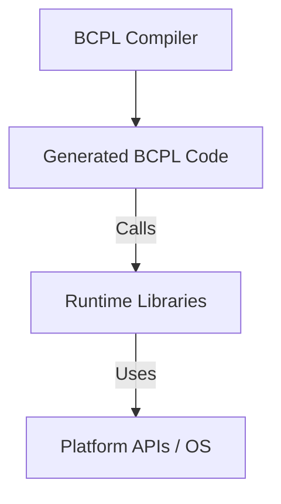
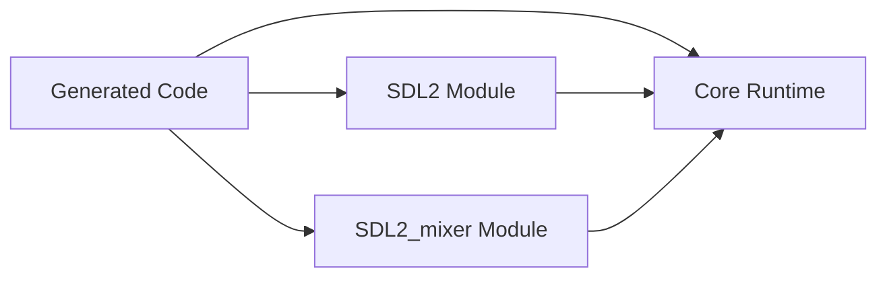

NewBCPL/book/runtime_overview.md
# Runtime Overview

This document provides a high-level overview of the runtime system for the NewBCPL project, focusing on its architecture, relationship to compiler-generated code, and the modular structure that supports extensibility and portability.

---

## What is the Runtime?

The runtime is a collection of libraries and support code that provides essential services for programs generated by the NewBCPL compiler. These services include memory management, error handling, I/O, string operations, and platform abstractions. The runtime is **separate from the compiler** and the code it generates, but it is tightly linked: the generated code expects to call into the runtime for many fundamental operations.

---

## High-Level Architecture

At a high level, the system can be visualized as follows:



- **Compiler**: Translates BCPL source code into target code (e.g., C, assembly, or bytecode).
- **Generated Code**: The output of the compiler, which contains program logic and calls into the runtime for services.
- **Runtime Libraries**: Implement core services and abstractions, providing a stable interface for generated code.
- **Platform APIs**: The underlying operating system or hardware interfaces used by the runtime.

---

## Separation of Concerns

- **Compiler**: Responsible for parsing, analyzing, and translating BCPL source code. It does not implement low-level operations like memory allocation or file I/O directly.
- **Runtime**: Implements these low-level operations, exposing them via a stable API that the generated code can call.

This separation allows:
- Porting the runtime to new platforms without changing the compiler.
- Evolving the compiler and runtime independently, as long as the interface remains stable.
- Supporting multiple runtimes (e.g., standard, SDL2, or custom-optimized versions) for different environments.

---

## Runtime Structure

The runtime is organized into several modules, each responsible for a specific aspect of program execution. For example:

```mermaid
graph TD
    subgraph Runtime
        A[Memory Management]
        B[String Operations]
        C[Error Handling]
        D[Platform Abstraction]
        E[File I/O]
        F[Specialized Modules (e.g., SDL2)]
    end

    A -->|APIs| CompilerGenerated
    B -->|APIs| CompilerGenerated
    C -->|APIs| CompilerGenerated
    D -->|APIs| CompilerGenerated
    E -->|APIs| CompilerGenerated
    F -->|APIs| CompilerGenerated

    CompilerGenerated[Generated Code]
```

- **Memory Management**: Heap allocation, garbage collection, etc.
- **String Operations**: Efficient string manipulation and utilities.
- **Error Handling**: Reporting and managing runtime errors.
- **Platform Abstraction**: Wrappers for OS-specific functionality.
- **File I/O**: Reading and writing files, streams, etc.
- **Specialized Modules**: Optional modules for graphics, sound, etc. (e.g., SDL2 support).

---

## Linking Generated Code and Runtime

When a BCPL program is compiled, the resulting code is linked with the runtime libraries. The generated code makes function calls to the runtime for operations such as:

- Allocating and freeing memory
- Performing I/O
- Handling errors and exceptions
- Interacting with platform-specific features

This linkage can be static (at compile/link time) or dynamic (at load/runtime), depending on the build system and platform.

---

## Extending the Runtime

The modular design allows for easy extension. For example, to add SDL2 support, a new module is added to the runtime, and the compiler can generate code that calls into this module when SDL2 features are used.



---

## Summary

- The runtime is a modular, platform-adaptable library that provides essential services to compiler-generated code.
- It is **separate from the compiler**, but the two are closely linked via a stable API.
- This separation enables portability, extensibility, and independent evolution of the compiler and runtime.

For more details on specific modules, see the corresponding documentation in the `runtime/` directory.